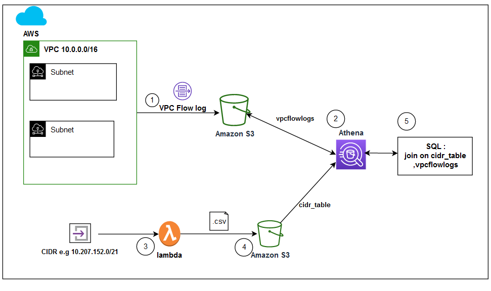

# Analyze Network Traffic of Amazon Virtual Private Cloud (VPC) by CIDR blocks

Blog **[Analyze Network Traffic of Amazon Virtual Private Cloud (VPC) by CIDR blocks](setup/InstructionGuide.md)** shows how you can analyze traffic going in and out of your VPC from a particular CIDR block by using VPC Flow Logs, Athena, and Lambda. We also showed how you can identify the specific IP dependencies between peered private VPCs. Furthermore, we showed how you can analyze the unintentional routing in and out of the VPC over private IP addresses.

# Solution overview
Solution shows how you can analyze traffic going in and out of your VPC from a particular CIDR block by using VPC Flow Logs, Athena, and Lambda

As part of our solution, you’ll first enable VPC Flow Logs on your targeted VPC. VPC Flow Logs is a feature that lets you capture information about the IP traffic going to and from your VPC network interfaces. VPC Flow Logs data can be published to Amazon CloudWatch Logs or Amazon Simple Storage Service (Amazon S3). In this solution, we will choose Amazon S3 as the destination.

Next, you will enable Athena. Athena is an interactive query service that makes it easy to analyze data directly in Amazon S3 by using standard SQL. Create an Athena table “vpcflowlogs” with the location set to the VPC Flow Logs destination in the Amazon S3 bucket.

VPC Flow Logs helps you identify the network traffic information mapped to specific IP addresses in your VPC. However, to filter traffic by a particular CIDR block or multiple CIDR blocks, you must create an additional Athena table that maps the CIDR block to a corresponding range of IP addresses. This mapping between the CIDR block and the corresponding range of IP addresses is generated using a Lambda function.

Next, you will create the Lambda function. Lambda is a serverless, event-driven compute service that lets you run code for virtually any type of application or backend service without provisioning or managing servers. This particular Lambda function will take its input as CIDR block and generate a corresponding range of IP addresses list as a .csv file on a separately created Amazon S3 bucket. Then, you’ll create an Athena table named “cidr_table” with its location set to the separately created Amazon S3 bucket.

Finally, we’ll show how to analyze the traffic coming to and going from the targeted VPC from the particular CIDR block by using SQL Join query on cidr_table and vpcflowlogs tables, as shown in the following figure.

  

# Setup
[Follow the instruction here](setup/InstructionGuide.md)

# Cloudformation template
[Download the CFN](https://github.com/aws-samples/vpc-cidr-analysis/blob/main/cfn_vpcflowlogs_cidr.json) 

# License
This library is licensed under the MIT-0 License. See the LICENSE file.
