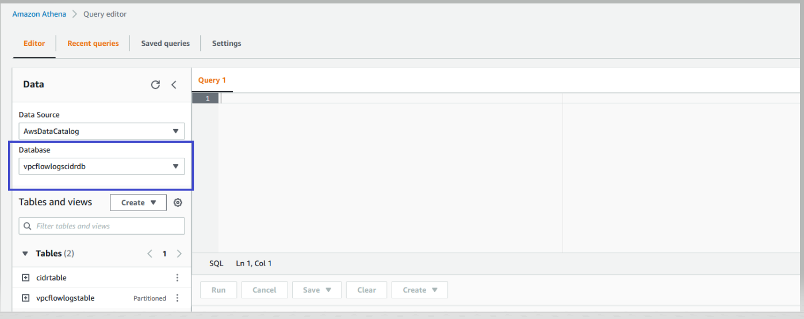

# Analyze Network Traffic of Amazon Virtual Private Cloud (VPC) by CIDR blocks

# Solution walkthrough
### Step 1: Enable VPC Flow Logs to publish to the Amazon S3 bucket.
Create the VPC Flow Logs subscription with Amazon S3 as a destination as illustrated in the VPC Flow Logs [user](https://docs.aws.amazon.com/vpc/latest/userguide/flow-logs-s3.html#flow-logs-s3-create-flow-log) guide.Note that after you create a VPC Flow Logs, it can take several minutes to begin collecting and publishing data to the Amazon S3 bucket. VPC Flow Logs don’t capture real-time log streams for your network interfaces.


### Step 2: Create the Athena database, Athena tables, and Lambda function

1. Start by navigating to AWS CloudFormation in the AWS Console in the account and Region where your VPC Flow Logs is created

2. Download the Cloudformation template cfn_vpcflowlogs_cidr.json from GitHub Repository
 ```
 git clone https://github.com/aws-samples/vpc-cidr-analysis
 ```

3. Click on Create Stack`
4. Choose the downloaded cfn_vpcflowlogs_cidr.json file as shown in diagram below.below.
<p align="center">
  

5. Enter Stack name.
6. Specify the name of the Amazon S3 bucket where VPC Flow Logs destination is set.
7. Projection start date: This will be the start date from which you want to query the VPC Flow Logs records.

<p align="center">
  

8. Select next twice, and on the final screen check the box that allows CloudFormation to create the AWS Identity and Access Management (IAM) resources before selecting Create Stack.
9. Go to the Resources section of the CloudFormation stack, and notice that the CloudFormation stack creates the following resources, as show in the following figure.

    - Athena database “vpcflowlogscidrdb”.
    - Athena table “vpcflowlogs”, with location set to VPC Flow Logs destination in the Amazon S3 bucket.
    - Lambda function “cidr_ip_generator”.
    - Amazon S3 bucket. The Lambda function will generate the CIDR wise range of IP addresses list and upload it to this Amazon S3 Bucket.
    - Athena table “cidrtable” with the destination set to the Amazon S3 bucket where the CIDR wise range of addresses list is stored.
    - IAM roles and Amazon S3 bucket polices.

<p align="center">
  

### Step 3: Generate the range of IP addresses corresponding to your VPC CIDR blocks
Now, with the necessary infrastructure created, you can create the CIDR Block wise range of IP addresses for your VPC CIDR blocks using the Lambda function.

1. Go to the Resources section of the CloudFormation stack.
2. Select the Lambda Function cidr_ip_generator, as highlighted in the following figure.

 <p align="center"> </p>
3. The Lambda function cidr_ip_generator will open in a separate browser window. Choose the Test tab, and select Configure event as shown in the following figure.
<p align="center">
  

4 Configure the test event and pass the “cidr” parameter as your VPC CIDR Block, as shown in the following figure. Then, run the Lambda Function for test event. After executing the Lambda function <CIDRBLOCK> .csv file will be generated for input cidr block on the Amazon S3 bucket. If you expand the Execution result of the Lambda function, then you can notice the name of Amazon S3 bucket where Lambda generates the <CIDRBLOCK> .csv file as highlighted in Figure The <CIDRBLOCK> .csv file has two columns, CIDR and IP, as shown in Figure.

<p align="center">
  
  <p align="center">
  
  <p align="center">
  

5. Optionally, you can run the Lambda function multiple times for different VPC CIDR blocks for which you want to analyze the traffic. Furthermore, you can run the Lambda programmatically and pass the JSON event with the parameter “cidr” instead of running it as the test event.
6. Next, we’ll analyze the VPC traffic by the CIDR block for different scenarios.
### Step 4: Analyze VPC network traffic via CIDR block by using Athena SQL

1. Open the Athena console, and select the database “vpcflowlogscidrdb”.
2. If you’re using Athena for the first time, then you must [setup a query result location](https://docs.aws.amazon.com/athena/latest/ug/getting-started.html). Once the query result location is setup, you can execute the Athena queries for each scenario.

<p align="center">
  

**Scenario 1:**  The following query provides information about all of the external IP address that VPC-A is communicating with by excluding the VPC’s internal network traffic over the period of the last 10 days.

Note that if the VPC has a public subnet using resources with public IP addresses that are outside of VPC-A’s CIDR block (10.0.0.0/16), then the following query will treat those IPs as external IP addresses.

**SQL**:
```
SELECT * FROM vpcflowlogscidrdb.vpcflowlogstable
 where NOT (dstaddr in (select ip from vpcflowlogscidrdb.cidrtable where CIDR='10.0.0.0/16')
and srcaddr in (select ip from vpcflowlogscidrdb.cidrtable where CIDR='10.0.0.0/16'))
and TO_DATE(day,'yyyy/mm/dd') > CURRENT_DATE- interval '10' day
```
**Result**
The following result shows all of the external IP addresses that are either receiving or sending network traffic to VPC-A.
<p align="center">
  

**Scenario 2** : You want disconnect the peering of VPC-A and VPC-B. For that, you must identify that VPC-A is communicating with specific resources (IP addresses) in VPC-B over a period of the last 10 days.

**SQL**:
```
SELECT * FROM vpcflowlogscidrdb.vpcflowlogstable
where (dstaddr in (select ip from vpcflowlogscidrdb.cidrtable where CIDR='10.1.0.0/16')
or srcaddr in (select ip from vpcflowlogscidrdb.cidrtable where CIDR='10.1.0.0/16'))
and TO_DATE(day,'yyyy/mm/dd') > CURRENT_DATE- interval '10' day
```
**Result:**

The following result shows all of the Source and Destination IP addresses that VPC-A and VPC-B are communicating with each other. The example results show that VPC-A has dependency with resource with the IP address 10.1.0.123 in VPC-B. To disconnect the VPC-A and VPC-B, this dependency of resource with IP address 10.1.0.123 must be addressed.
<p align="center">
  

**Scenario 3**: You want to identify any resources in VPC-C that are inadvertently communicating with VPC-A. The following query provides information about all of the traffic coming to or going out of VPC-C from VPC -A over the period of the last 10 days

**SQL**:
```
SELECT * FROM vpcflowlogscidrdb.vpcflowlogstable
where (dstaddr in (select ip from vpcflowlogscidrdb.cidrtable where CIDR='10.2.0.0/16') 
or srcaddr in (select ip from vpcflowlogscidrdb.cidrtable where CIDR='10.2.0.0/16'))
and TO_DATE(day,'yyyy/mm/dd') > CURRENT_DATE- interval '10' day
```
**Result**:

The results show that the source with the IP address 10.2.0.146 in VPC-C is inadvertently communicating with the VPC-A resource with the IP address 10.0.0.151.
<p align="center">
  

**Scenario 4**: You want to identify the VPC internal-only traffic. The following query provides information on VPC-A’s internal-only traffic over the period of the last 10 days.

Note that if the VPC is using resources with public IP addresses that are outside of VPC-A’s CIDR block (10.0.0.0/16), then the following query won’t be able to capture traffic going in and out of these public IPs.
**SQL**:
```
SELECT * FROM vpcflowlogscidrdb.vpcflowlogstable
where (dstaddr in (select ip from vpcflowlogscidrdb.cidrtable where CIDR='10.0.0.0/16')
and srcaddr in (select ip from vpcflowlogscidrdb.cidrtable where CIDR='10.0.0.0/16'))
and TO_DATE(day,'yyyy/mm/dd') > CURRENT_DATE- interval '10' day
```
**Result**:

The following result shows that the resource with the IP address 10.0.0.151 is communicating with the Amazon Elastic Compute Cloud (Amazon EC2) instance 10.0.0.175.
<p align="center">
  


**Scenario 5**: The following query provides information about all of the incoming traffic from VPC-B to VPC -A over the period of the last 10 days.
**SQL**:
```
SELECT * FROM vpcflowlogscidrdb.vpcflowlogstable JOIN  vpcflowlogscidrdb.cidrtable ON  srcaddr=ip
AND  CIDR='10.1.0.0/16' and TO_DATE(day,'yyyy/mm/dd') > CURRENT_DATE- interval '10' day
```
**Result**:

The following result shows all of the incoming traffic from VPC-B to VPC-A.

<p align="center">
  

These are some sample queries provided, and you can further modify the queries to filter out, exclude, or include traffic generated from the target CIDR Blocks. Furthermore, you can adjust the number of day intervals based on your specific requirements.

## Clean up

#### Step 1: Delete the VPC Flow Logs

If you have created VPC Flow Logs specifically for this solution, then you can delete the VPC Flow Logs by following the instructions provided [here](https://docs.aws.amazon.com/vpc/latest/userguide/working-with-flow-logs.html#delete-flow-log).

### Step 2: Delete the CloudFormation Stack

Delete the CloudFormation stack that you deployed.